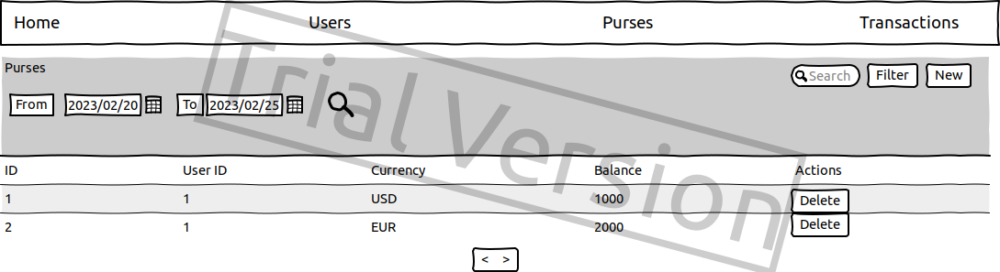

# E-wallet

## Vision
The purpose of this document is to define the requirements for an E-wallet web application. The application is intended to be used by customers to manage their digital money and make payments online.

Application should provide:
- Storing clients, wallets, transactions, and other data in a database
- Displaying the list of clients
- Updating client data (adding, editing, deleting)
- Displaying the list of wallets
- Updating wallet data (adding, editing, deleting)
- Displaying the list of transactions
- Updating transaction data (adding)
- Displaying the list of currencies and their exchange rates
- Filtering data in tables

---

## 1. Clients
### 1.1. Display list of clients
The application should display the list of clients.

#### Main scenario:
- User selects item “Clients”
- Application displays list of clients

The list displays the following columns:
- ID
- Name
- Email
- Phone
- Others

#### Filtering by date:
- In the clients list view, the user sets a date filter and clicks the search list button (to the right of the date entry field)
- The application will display a form to view the list of clients with updated data.

### 1.2. Add client

#### Main scenario:
- User clicks the “Add” button in the clients list view
- Application displays form to enter client data
- User enters client data and presses “Save” button
- If any data is entered incorrectly, incorrect data messages are displayed
- If entered data is valid, then record is adding to database
- If error occurs, then error message is displaying
- If new client record is successfully added, then list of clients with added records is displaying.

#### Cancel operation scenario:
- User clicks the “Add” button in the clients list view
- Application displays form to enter client data
- If the user selects the menu item "Clients”, "Purses" or "Transactions", the data will not be saved to the database and the corresponding form with updated data will be opened.

When adding a client, the following details are entered:
- Name
- Email
- Phone
- Others

### 1.3. Edit client

#### Main scenario:
- User clicks on the client id in the clients list view
- Application displays form to enter client data
- User enters client data and presses “Save” button
- If any data is entered incorrectly, incorrect data messages are displayed
- If entered data is valid, then edited data is added to database
- If error occurs, then error message is displaying
- If client record is successfully edited, then list of clients with added records is displaying.

#### Cancel operation scenario:
- User clicks on the client id in the clients list view
- Application displays form to enter client data
- If the user selects the menu item "Clients”, "Purses" or "Transactions", the data will not be saved to the database and the corresponding form with updated data will be opened.

When editing a client, the following details are entered:
- Name
- Email
- Phone
- Others

#### 1.4. Removing client

#### Main scenario:
- The user, while in the list of clients, presses the "Delete" button in the selected client line
- A confirmation dialog is displayed
- The user confirms the removal of the client
- Record is deleted from database
- Purses of the client are deleted from database
- If error occurs, then error message displays
- If client record is successfully deleted, then list of clients without deleted records is displaying.

#### Cancel operation scenario:
- The user, while in the list of clients, presses the "Delete" button in the selected client line
- A confirmation dialog is displayed
- User press “Cancel” button
- List of clients without changes is displaying.

---

## 2. Purses
The application should display the list of purses.

### 2.1. Display list of purses

#### Main scenario:
- User selects item “Purses”
- Application displays list of purses

The list displays the following columns:
- ID
- Client ID
- Currency
- Balance
- Others

#### Filtering by date:
- In the purses list view, the user sets a date filter and clicks the search list button (to the right of the date entry field)
- The application will display a form to view the list of purses with updated data.

### 2.2. Add purse

#### Main scenario:
- User clicks the “Add” button in the purses list view
- Application displays form to enter purse data
- User enters purse data and presses “Save” button
- If any data is entered incorrectly, incorrect data messages are displayed
- If entered data is valid, then record is adding to database
- If error occurs, then error message is displaying
- If new purse record is successfully added, then list of purses with added records is displaying.

#### Cancel operation scenario:
- User clicks the “Add” button in the purses list view
- Application displays form to enter purse data
- If the user selects the menu item "Clients”, "Purses" or "Transactions", the data will not be saved to the database and the corresponding form with updated data will be opened.

When adding a purse, the following details are entered:
- Client ID
- Currency
- Balance
- Others

### 2.3. Edit purse

#### Main scenario:
- User clicks on the purse id in the purses list view
- Application displays form to enter purse data
- User enters purse data and presses “Save” button
- If any data is entered incorrectly, incorrect data messages are displayed
- If entered data is valid, then edited data is added to database
- If error occurs, then error message is displaying
- If purse record is successfully edited, then list of purses with added records is displaying.

#### Cancel operation scenario:
- User clicks on the purse id in the purses list view
- Application displays form to enter purse data
- If the user selects the menu item "Clients”, "Purses" or "Transactions", the data will not be saved to the database and the corresponding form with updated data will be opened.

When editing a purse, the following details are entered:
- Client ID (not editable)
- Currency (not editable)
- Balance (not editable)
- Others

#### 2.4. Removing purse

#### Main scenario:
- The user, while in the list of purses, presses the "Delete" button in the selected purse line
- A confirmation dialog is displayed
- The user confirms the removal of the purse
- Record is deleted from database
- If error occurs, then error message displays
- If purse record is successfully deleted, then list of purses without deleted records is displaying.

#### Cancel operation scenario:
- The user, while in the list of purses, presses the "Delete" button in the selected purse line
- A confirmation dialog is displayed
- User press “Cancel” button
- List of purses without changes is displaying.

---

## 3. Transactions
The application should display the list of transactions.

### 3.1. Display list of transactions

#### Main scenario:
- User selects item “Transactions”
- Application displays list of transactions

The list displays the following columns:
- ID
- Purse from ID
- Purse to ID
- Purse from currency
- Purse to currency
- Purse from amount
- Purse to amount
- Others

#### Filtering by date:
- In the transactions list view, the user sets a date filter and clicks the search list button (to the right of the date entry field)
- The application will display a form to view the list of transactions with updated data.

### 3.2. Add transaction

#### Main scenario:
- User clicks the “Add” button in the transactions list view
- Application displays form to enter transaction data
- User enters transaction data and presses “Save” button
- If any data is entered incorrectly, incorrect data messages are displayed
- If entered data is valid, then record is adding to database
- Balances of purses is updating
- If error occurs, then error message is displaying
- If new transaction record is successfully added, then list of transactions with added records is displaying.

#### Cancel operation scenario:
- User clicks the “Add” button in the transactions list view
- Application displays form to enter transaction data
- If the user selects the menu item "Clients”, "Purses" or "Transactions", the data will not be saved to the database and the corresponding form with updated data will be opened.

When adding a transaction, the following details are entered:
- Purse from ID
- Purse to ID
- Purse from currency (auto)
- Purse to currency (auto)
- Purse from amount
- Purse to amount (auto)
- Others

### 3.3. Edit transaction

#### Main scenario:
- User clicks on the transaction id in the transactions list view
- Application displays form to enter transaction data
- User enters transaction data and presses “Save” button
- If any data is entered incorrectly, incorrect data messages are displayed
- If entered data is valid, then edited data is added to database
- If error occurs, then error message is displaying
- If transaction record is successfully edited, then list of transactions with added records is displaying.

#### Cancel operation scenario:
- User clicks on the transaction id in the transactions list view
- Application displays form to enter transaction data
- If the user selects the menu item "Clients”, "Purses" or "Transactions", the data will not be saved to the database and the corresponding form with updated data will be opened.

When editing a transaction, the following details are entered:
- Purse from ID (not editable)
- Purse to ID (not editable)
- Purse from currency (not editable)
- Purse to currency (not editable)
- Purse from amount (not editable)
- Purse to amount (not editable)
- Others

---